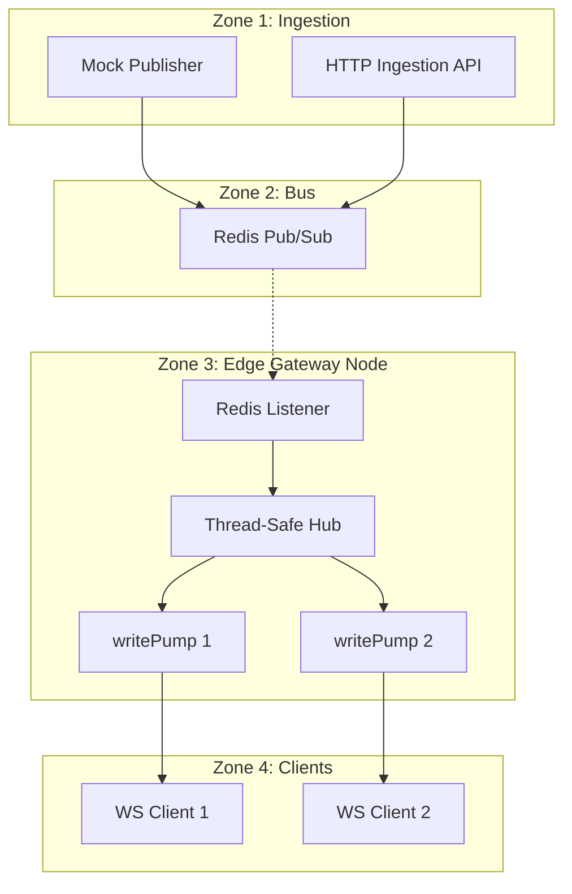

# MarketMux

MarketMux is a high-performance market data distribution gateway designed for low-latency fan-out of real-time price updates to thousands of concurrent WebSocket clients.

Built with Go, it provides an efficient "point of presence" that decouples data ingestion from client delivery, ensuring that price updates are delivered with sub-millisecond overhead.

## Architecture

MarketMux is designed as a distributed pipeline that ensures price updates move from source to subscriber with minimal overhead.



## Key Engineering Features

### Concurrent Fan-Out
Each connected client is managed by two dedicated goroutines:
- **`readPump`**: Handles incoming control messages (subscriptions/unsubscriptions) and connection health.
- **`writePump`**: Listens to a buffered private channel and pushes data to the socket. This ensures that a slow client never blocks the central distribution hub.

### Thread-Safe Routing
The core of the gateway is a `Hub` that maps symbols (e.g., `AAPL`) to active client sets. It utilizes a `sync.RWMutex` to allow high-concurrency reads while ensuring safe state updates during client registration or subscription changes.

### Resilience & Observability
- **Race-Condition Safety:** The codebase is validated using Go's race detector to ensure the hub and client state management are robust under heavy contention.
- **Leak Detection:** Integrated `pprof` endpoints allow for real-time monitoring of goroutine counts, ensuring that connections are properly cleaned up and resources are reclaimed.
- **Non-Blocking Broadcasts:** The hub uses non-blocking sends to client channels, preventing "slow consumers" from causing backpressure on the entire system.

## Getting Started

### Prerequisites
- Go 1.26+
- Docker (for Redis/Valkey)

### 1. Start Infrastructure
```bash
docker-compose up -d
```

### 2. Run the Gateway
```bash
go run cmd/gateway/main.go
```

### 3. Run the Mock Publisher
```bash
go run cmd/mock-publisher/main.go
```

## Testing & Load Generation

The project includes a load testing utility capable of simulating thousands of concurrent WebSocket subscribers:

```bash
# Open 5,000 connections subscribing to AAPL
go run cmd/load-test/main.go -c 5000 -symbol AAPL
```

To run the internal stress tests with the race detector:
```bash
go test -race ./internal/hub/...
```

## API Reference

### Ingestion API
`POST /api/v1/ticks`
```json
{
  "symbol": "AAPL",
  "price": 150.25,
  "timestamp": "2026-05-12T15:04:05Z"
}
```

### WebSocket API
`GET /ws`

**Subscribe:**
```json
{ "action": "subscribe", "symbol": "AAPL" }
```

**Unsubscribe:**
```json
{ "action": "unsubscribe", "symbol": "AAPL" }
```
